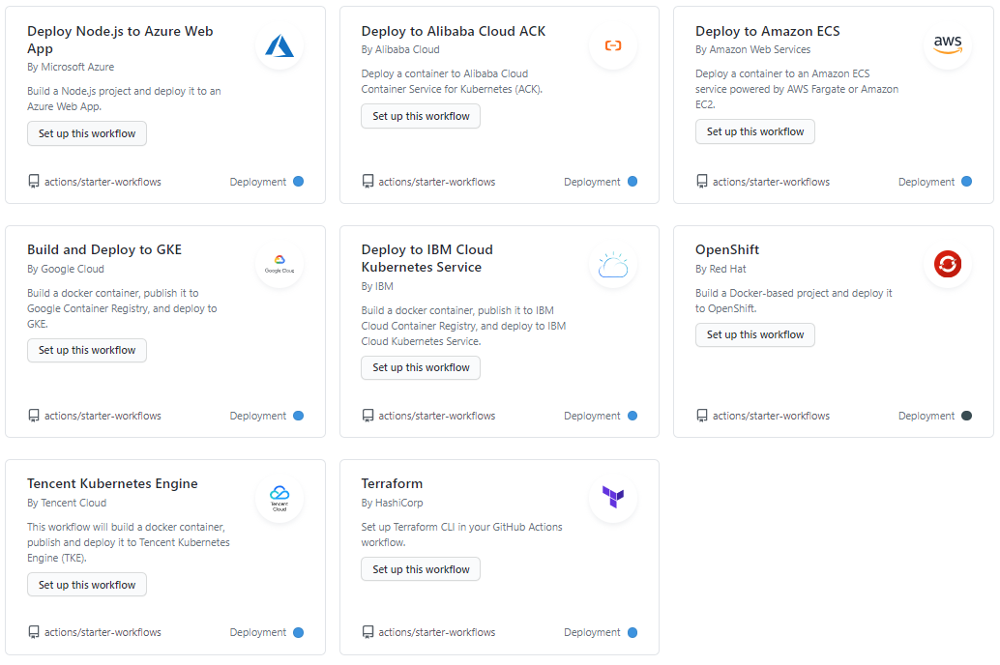

## Introduction

On this research I am going to talk about Automated Builds with Continous Integration and Continous Deployment, I will explain the basics concepts of this topic, how to implement it on your repositories and the different uses that we can give to them.

## Automated Builds

Build automation is the process of automating the retrieval of source code, compiling it into binary code, executing automated tests, and publishing it into a shared, centralized repository.

Build automation is a critical first step of any CI/CD process. You must have build automation in place in order for Continuous Integration (CI) and Continous Deployment (CD) to occur.

Automated Builds advantages:
- A necessary pre-condition for continuous integration and continuous testing
- Improve product quality
- Accelerate the compile and link processing
- Eliminate redundant tasks
- Minimize "bad builds"
- Eliminate dependencies on key personnel
- Have history of builds and releases in order to investigate issues
- Save time and money - because of the reasons listed above.

  We can find different types of automation softwares for different code languages that can be applied on Github Actions (what I will talk about later), there are all the avaible ones for each automated build task:
  

#### For Continous Deployment:

  

#### For Continous Integration:

  

  

  

  

### Continous Integration (CI)

Continuous Integration (CI) is a software development strategy that increases the speed of development while ensuring the quality of the code that teams deploy. Developers continually commit code in small increments, which is then automatically built and tested before it is merged with the shared repository.

Continous integration benefits:
- Improve team productivity and efficiency
- Accelerate speed to market
- Identify product/market fit
- Release higher quality, more stable products
- Increase customer satisfaction
- Keep developers happy and shipping code

How Continous Integration works?

  

When the developer performs a push on the source code Continous Integration automatically builds the code and test it, once is test it, the software reports if the code works, if the code is correct automatically will release it to the selected branch.

### Continous Deployment (CD)

Continuous Deployment builds on Continous Integration, is the methodology of creating a robust testing framework and automatically pushing your code out when tests pass. When new code is committed and passes the CI tests, the code is automatically deployed to production. 

Continuous deployment also encourages other kinds of continuous action, like analytics, error reporting, and testing.

Continous deployment benefits:
- Automate the repetitive tasks and focus on actual testing.
- Make deployments frictionless without compromising security.
- Connect your existing tools and technologies (such as CI providers or scripts) into a harmonious workflow.
- Integrate teams and processes with a unified pipeline.
- Create workflows across the development, testing, and production environments
- Ship both cloud-native and traditional applications in a unified pipeline.
- Improve overall productivity.

How Continous Deployment works?

As mentioned before, Continous Deployment works on Continous Integration, the work of Continous Deployment Software or Continous Delivery is to push and commit the code after the Continous Integration tests finished.

  

On the diagram above we can see all the phases of an Automated Build with the Continous Integration and Continous Deployment working on it. As you can see, the CI software is the first one working, it builds and test the code, after that the CD sfotware enters in scene testing the release to deploy it and finally operate it.

## GitHub Actions

  

GitHub Actions is the way we will integrate Automated Builds in our GitHub projects, with this tool we can automate, customize, and run our software development workflows (what I will talk more deeply later) directly in our repository. We can discover, create and share actions to perform any job you want, including CI / CD, and combine actions into a completely customized workflows.
Thanks to GitHub we will be capable to download actions already programmed by other users and use them directly in our project.

We know what Automated Builds are and how they work, but how we set up automated builds with Github Actions?

1. Go to your repository main page
2. Click on "Actions" below your repository name

  

3. Find the software you want that matches the code you are gonna work with and click "Set up this workflow" (these are the above mentioned softwares for CI) in my case I used "Jekyll" that is based on HTML

  

4. Click on "Start Commit"

  

5. Select "Create new branch for this commit and start a pull request" and name it as you want and click on "Propose new file"

  

6. Click on "Create pull request"

  

### Workflows

Now we have our Continous Integration workflow added on our GitHub, but what exactly are these workflows? How they work?

Workflows are all the processes of Build Automation such as build, test, package, release, or deploy our code on GitHub.

They are an automated procedure made up of one or more jobs that is added to a repository and can be triggered by an event. They are defined using yaml. or yml. files and with it you can build, test, package, reread or deploy a project.

#### Basic Concepts:

#### Event

They are specific activities that trigger the execution of a workflow.

#### Job

It is a set of steps that are executed in the runner of our process. Jobs can be run independently or sequentially depending on whether the success of our work depends on the previous one.

#### Steps

It consists of a set of tasks to be able to execute a job. These can execute commands or actions.

#### Actions/Commands

It is the smallest building block in a workflow and can be combined as steps to create a job.

  

#### Runner

It is a machine with the GitHub Actions application already installed, whose function is to wait for the jobs to be available and then be able to execute the actions and report the progress and results.

### Some GitHub Actions uses and benefits

Guide to write scripts, manual copying README files, etc.
One of the defining characteristics of GitHub Actions is the flexibility it provides, which translates into opening up a wide range of possibilities in which developers can unleash their creativity. Here are some other benefits that GitHub Actions offers:

#### Developing on GitHub

The Actions option is fully integrated into GitHub, so it doesn't require an external site. This means that we can manage everything in the same place where we have the functions related to the repository.

#### Big variety of CI templates

The platform provides many templates for all kinds of Continous Integration configurations, making it much easier to get started. In addition, you also have the option to create your own templates to later publish them on GitHub Marketplace.

#### Free for everyone

GitHub Actions is free for all open source repositories, and allows you to download and create your own workflows.

## Create your own workflow

You can create your own workflows for GitHub Actions:

1. Go to Github and select "New workflow"

  

2. Click on "Set Up This Workflow" on Simple workflow 

  

3. Now you can modify the code as you want for create the workflow you want, if you want a more detailed guide of how the workflow works I recommend you to visit this <a href="https://gabrieltanner.org/blog/an-introduction-to-github-actions">website</a>  wich explains much more deeper how the workflow code works

  

### Automatically zip. and Upload

One of the best things of Github Actions is to create your own release based on your code, this is a basic tutorial for you to do it easily:

1. Follow all the last tutorial guidelines and stay on the code editor

2. We are gonna use two Github Actions from the Marketplace, one will be <a href="https://github.com/marketplace/actions/zip-release">Zip Release</a>  for creating our personalizaed zip on our release and the other will be <a href="https://github.com/marketplace/actions/create-release">Create Release</a>  wich combined with the other one, will make the release on our tags section

  

  

3. We need to implement the github actions by copying and pasting on our code, is so easy to implement but be sure to align the commands at the correct distance otherwise they won't work. You can modify the two of them as you want, for example on the Zip Release you can exclude the elements you don't need on your zip or select the folder directory that you want to zip, for thr Create Release code there are a bunch of options too, you can implement any as you want in order to personalize your release.

This is a functional basic code that creates a release on your tags to have it as an example.

  

### Automatic Builds and Notifications

You can receive Automated Builds notifications on your gmail if you want, is so easy to activate this feature:

  

If this option is enabled you will recieve a notification each time the push fails or the CD makes a release, is activated by default

### Automatic Builds Uses

There are a lot of actions that you can do with Automatic Builds in GitHub Actions, like compress files or folders, make releases, change the readme version, upload releases, etc. With the Marketplace and your own code the limit of possibilities is your own imagination!

  

## Sources Links

<a href="https://www.youtube.com/watch?v=cP0I9w2coGU&ab_channel=GitHub">https://www.youtube.com/watch?v=cP0I9w2coGU&ab_channel=GitHub</a> 

<a href="https://docs.github.com/es/actions/guides/setting-up-continuous-integration-using-workflow-templates">https://docs.github.com/es/actions/guides/setting-up-continuous-integration-using-workflow-templates</a> 

<a href="https://www.perforce.com/blog/vcs/build-automation#:~:text=Build%20automation%20is%20the%20process,into%20a%20shared%2C%20centralized%20repository.">https://www.perforce.com/blog/vcs/build-automation#:~:text=Build%20automation%20is%20the%20process,into%20a%20shared%2C%20centralized%20repository</a> 

<a href="https://circleci.com/continuous-integration/?utm_medium=SEM&utm_source=gnb&utm_campaign=SEM-gb-DSA-Eng-emea&utm_content=&utm_term=dynamicSearch-&gclid=CjwKCAjwvMqDBhB8EiwA2iSmPCtaregAKqrh34Nf2OVNWYPRqjf38NP4E1ZbAEIeDrBVJMSNu7jMtRoCq3oQAvD_BwE">https://circleci.com/continuous-integration/?utm_medium=SEM&utm_source=gnb&utm_campaign=SEM-gb-DSA-Eng-emea&utm_content=&utm_term=dynamicSearch-&gclid=CjwKCAjwvMqDBhB8EiwA2iSmPCtaregAKqrh34Nf2OVNWYPRqjf38NP4E1ZbAEIeDrBVJMSNu7jMtRoCq3oQAvD_BwE</a> 

<a href="https://circleci.com/blog/a-brief-history-of-devops-part-iv-continuous-delivery-and-continuous-deployment/?utm_medium=SEM&utm_source=gnb&utm_campaign=SEM-gb-DSA-Eng-emea&utm_content=&utm_term=dynamicSearch-&gclid=CjwKCAjwvMqDBhB8EiwA2iSmPMWOf-31NesTKlzN2DE5NnP2vebxNsTVT36TD4JJUrrJ-BfqXk3iPhoCP9oQAvD_BwE">https://circleci.com/blog/a-brief-history-of-devops-part-iv-continuous-delivery-and-continuous-deployment/?utm_medium=SEM&utm_source=gnb&utm_campaign=SEM-gb-DSA-Eng-emea&utm_content=&utm_term=dynamicSearch-&gclid=CjwKCAjwvMqDBhB8EiwA2iSmPMWOf-31NesTKlzN2DE5NnP2vebxNsTVT36TD4JJUrrJ-BfqXk3iPhoCP9oQAvD_BwE</a> 

<a href="https://www.plainconcepts.com/es/que-es-github-actions/">https://www.plainconcepts.com/es/que-es-github-actions/</a> 

<a href="https://gabrieltanner.org/blog/an-introduction-to-github-actions">https://gabrieltanner.org/blog/an-introduction-to-github-actions</a> 

<a href="https://github.com/marketplace/actions/create-release">https://github.com/marketplace/actions/create-release</a> 

<a href="https://github.com/marketplace/actions/zip-release">https://github.com/marketplace/actions/zip-release</a> 

## Contact

Gmail: <a href="davidlira1909@gmail.com">davidlira1909@gmail.com</a> 

GitHub: <a href="https://github.com/davidlira19">https://github.com/davidlira19</a> 
